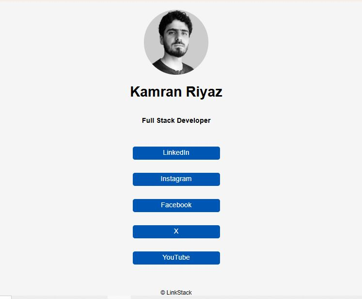

# LinkStack

A personal link page for Kamran Riyaz, showcasing his social media profiles and professional identity as a Full Stack Developer.

## What This Project Does

This project is a simple, responsive personal link page that serves as a central hub for Kamran Riyaz's online presence. It displays his profile picture, name, and title, along with clickable links to his various social media platforms including LinkedIn, Instagram, Facebook, X (formerly Twitter), and YouTube.

## Tech Stack

- **HTML5**: For the structure and content of the page
- **CSS3**: For styling, layout, and responsive design

## How to Run It Locally

1. Clone or download this repository to your local machine.
2. Navigate to the project directory.
3. Open the `index.html` file in your preferred web browser.
4. The page will load and display the link stack.

## Screenshots

## One Thing I Learned

During the development of this project, I learned the importance of responsive design principles. By using CSS media queries and flexible units, I was able to create a layout that adapts seamlessly to different screen sizes, ensuring a good user experience on both desktop and mobile devices.